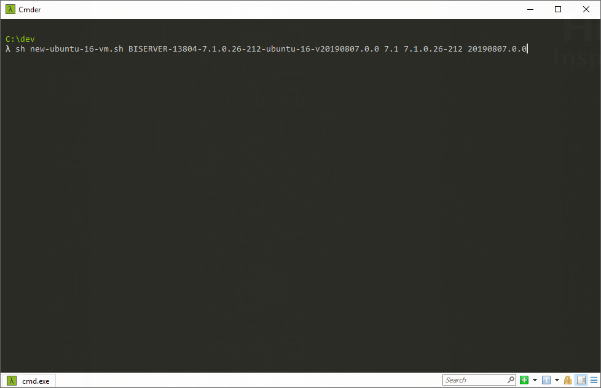

# Scripts

## Create a new Ubuntu 16.04 machine in one step

### New Ubuntu 16.04 machine with 7.1 and 7.1.0.26-212 SP installed using Ubuntu version 20190807.0.0

```shell
sh new-ubuntu-16-vm.sh BISERVER-13804-7.1.0.26-212-ubuntu-16-v20190807.0.0 7.1 7.1.0.26-212 20190807.0.0
```



After this, you will see a new folder with the same name you specified above. Go to that folder and run *vagrant up*

### New Ubuntu 16.04 machine with 7.1 and 7.1.0.26-212 SP installed using Ubuntu version 20190805.0.0

```shell
sh new-ubuntu-16-vm.sh BISERVER-13804-7.1.0.26-212-ubuntu-16-v20190805.0.0 7.1 7.1.0.26-212 20190805.0.0
```


After this, you will see a new folder with the same name you specified above. Go to that folder and run *vagrant up*
